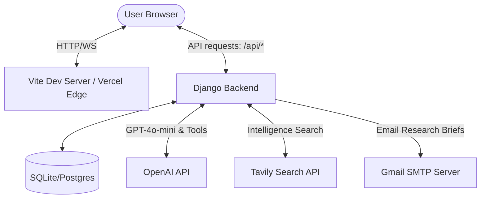

# ResearchOps AI — Loid Assistant

[](https://opensource.org/licenses/MIT)
[](https://www.python.org/)
[](https://react.dev/)
[](https://www.djangoproject.com/)

ResearchOps AI is a unified web application that serves as a research and intelligence platform. It features **Loid**, a precise, professional, and discreet assistant powered by OpenAI's GPT models, Tavily Web Search, and Django. Loid operates in two primary modes: a concise **Normal Chat** mode and a deep **Mission-driven Research** mode.

---

## 🗺️ System Architecture



---

## ⚡ Core Features

### 1. Normal Chat Mode
* **Concise & Direct**: Under normal chat conditions, Loid restricts answers to exactly **5-6 lines** formatted entirely in **Markdown**.
* **Length Constraints**: Textarea inputs are strictly validated and limited to **2,000 characters** max in both the frontend and backend, with a real-time countdown display.
* **Smart Tool Utilization**: Performs quick operations like mathematical calculations or time checks dynamically using function calling.

### 2. Mission-driven Research Mode
* **Deep Crawling**: Performs web searches using Tavily and parses relevant page content dynamically to filter facts.
* **Structured Intelligence Briefs**: Formats the final answer systematically with:
  - **Research brief**: A 3-4 line quick summary.
  - **Key intelligence**: Crucial points in bullet format.
  - **Intelligence sources**: Citations with exact URLs used during extraction.
  - **Limitations**: A list of data gaps or caveats.
* **Email Delivery**: Offers the ability to dispatch the generated research brief directly to the user's registered email address.

### 3. Built-in Security & Controls
* **Authentication**: Token-based JWT-style authentication with configurable Token TTL.
* **Device-Based Rate Limiting**: Limit daily chat requests and research queries based on unique device fingerprints to prevent abuse.
* **Secure URL Redirection and DNS Resolving**: Mitigates Server-Side Request Forgery (SSRF) and private network probing.

---

## 🛠️ Technology Stack

| Component | Technology | Description |
| :--- | :--- | :--- |
| **Frontend** | React (v18), Vite, TailwindCSS, Lucide Icons | Premium glassmorphic interface with reactive layouts |
| **Backend** | Django (Python 3), Django ORM | Secure REST APIs, authentication, rate limiting, and tool routing |
| **Database** | SQLite (Local Dev) / PostgreSQL (Production) | Persistent store for users, rate limits, and history |
| **Integrations** | OpenAI API (`gpt-4o-mini`), Tavily Client, SMTP | Language intelligence, real-time search, and email dispatch |

---

## 📁 Repository Structure

```text
Research_assistant/
├── backend/                       # Django Backend
│   ├── assistant_core/            # Core assistant logic (Views, Models, Loid LLM agent)
│   └── research_api/              # Project settings, routes, and WSGI entrypoint
├── src/                           # React Frontend
│   ├── components/                # Reusable UI elements (Message cells, layout panels)
│   ├── pages/                     # Main pages (Assistant Interface, Profile, Auth)
│   └── lib/                       # API request client utilities
├── public/                        # Static assets (logos, icons)
├── build.py                       # Integrated build script for production / Vercel
├── vercel.json                    # Vercel routing & framework configuration
├── requirements.txt               # Backend dependencies
└── package.json                   # Frontend dependencies
```

---

## ⚙️ Configuration & Environment Variables

Create a `.env` file in the root directory (refer to `.env.example`):

```env
# Django Settings
DJANGO_DEBUG=true
DJANGO_SECRET_KEY=local-development-secret-key-123

# LLM & Search API Credentials
OPENAI_API_KEY=your_openai_api_key_here
TAVILY_API_KEY=your_tavily_api_key_here

# Email SMTP Credentials (Optional - for Research Brief delivery)
EMAIL_ADDRESS=your_gmail_address@gmail.com
EMAIL_APP_PASSWORD=your_gmail_app_password_here
```

---

## 🚀 Local Development Setup

### 1. Clone & Setup Python Virtual Environment
```bash
# Clone the repository
git clone https://github.com/mr-d-nobody/Research_Assistant.git
cd Research_Assistant

# Create a virtual environment
python -m venv .venv
source .venv/bin/activate  # On Windows: .venv\Scripts\activate

# Install backend dependencies
pip install -r requirements.txt
```

### 2. Run Database Migrations
```bash
# Navigate to backend directory and migrate
python backend/manage.py migrate
```

### 3. Install Frontend Dependencies
```bash
# Install NPM packages
npm install
```

### 4. Run the Servers

To run the full stack locally:
* **Start Backend**: `python backend/manage.py runserver` (runs on `http://127.0.0.1:8000`)
* **Start Frontend**: `npm run dev` (runs on `http://localhost:5173`)

---

## 🌐 Production Deployment

The project is fully prepared to deploy as a unified project on **Vercel**:

1. **Deployment Preset**: Select **Django** on Vercel.
2. **Root Directory**: `./`
3. **Install Command**: `npm ci && pip install -r requirements.txt`
4. **Build Command**: `python build.py`
5. **Environment Variables**: Add all parameters from `.env` in the Vercel Dashboard project settings.
